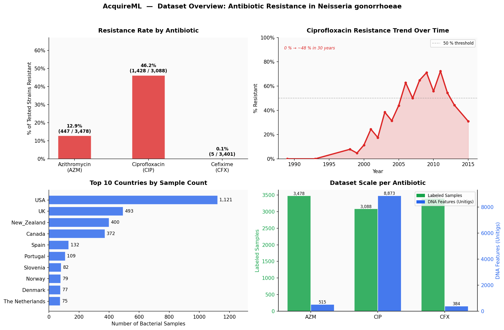
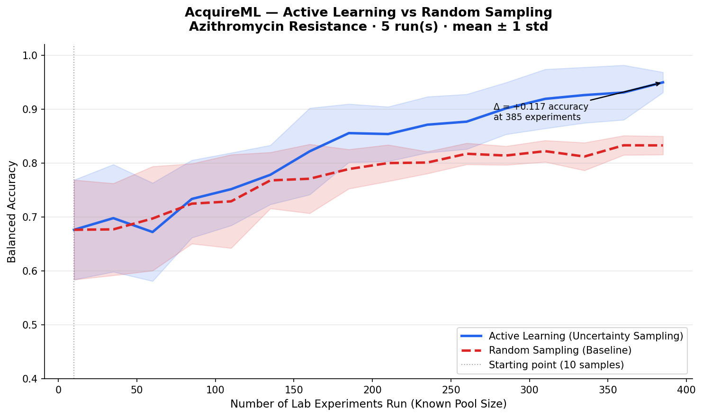
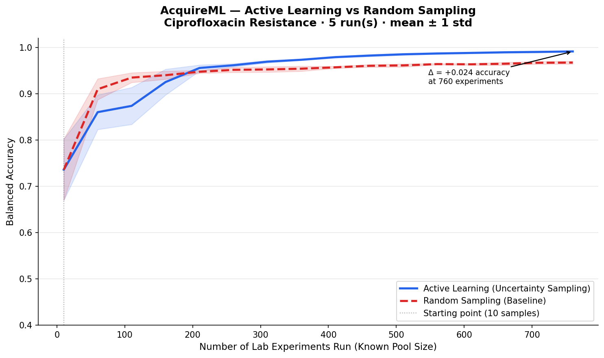
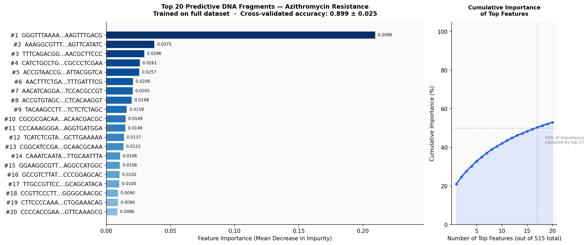
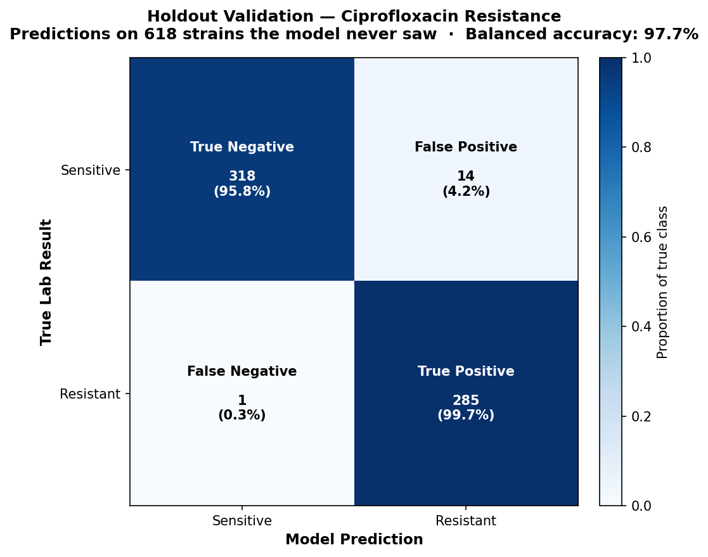
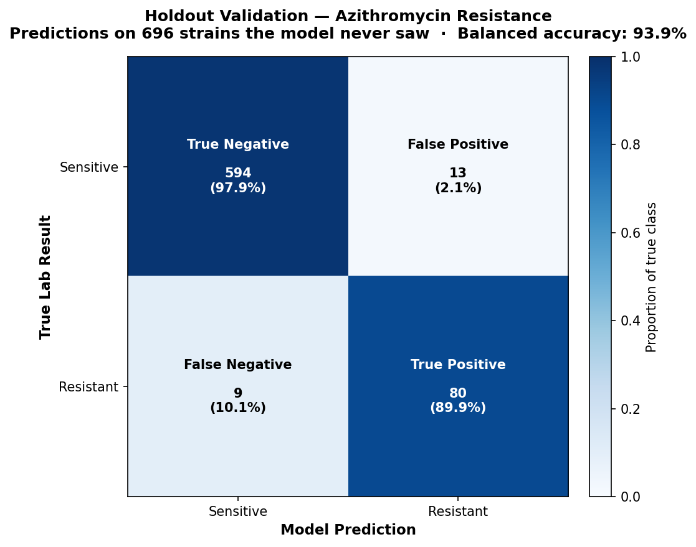

# AcquireML

**Autonomous Experimental Engine for Genomic Optimization**

Most AI tools in genomics are predictive classifiers — they tell you whether a sample you already have is resistant or not. AcquireML does something different: it acts as a **GPS for your lab**, telling you exactly which experiment to run *next* in order to map a biological system in the fewest possible tests.

Instead of passively predicting outcomes, AcquireML actively optimizes your experimental budget.

---

## The Problem

Antibiotic resistance is one of the fastest-moving crises in modern medicine. Ciprofloxacin — once a first-line treatment for gonorrhea — went from **0% resistance in the 1980s to 46% resistance today**.



Mapping resistance across thousands of bacterial strains is slow and expensive. Each lab test costs time, materials, and trained personnel. The question isn't just *"which strains are resistant?"* — it's *"which strain should I test next to learn the most, as fast as possible?"*

That's the problem AcquireML solves.

---

## How It Works

AcquireML treats antibiotic resistance as a **black-box optimization problem**:

1. The lab runs a small set of initial experiments (e.g. 10 bacterial strains)
2. AcquireML trains a model on those results
3. It scans the unexplored pool and finds the strains the model is **most uncertain about** — the ones that would teach it the most
4. Those strains become the next recommended experiments
5. The lab runs them, reveals the results, and the model retrains
6. Repeat — accuracy compounds with every iteration

This is called **Active Learning with Uncertainty Sampling**. The key insight is that not all experiments are equally informative. Choosing strategically means you need far fewer of them.

---

## Results

### Active Learning vs Random Sampling

Both charts show our engine (blue) versus random experiment selection (red dashed), starting from the same 10 samples, averaged across 5 independent runs.

**Azithromycin** — a growing threat at 13% resistance:



**Ciprofloxacin** — the most urgent drug at 46% resistance:



| Antibiotic | AL Accuracy | Random Accuracy | Advantage | Experiments Run |
|---|---|---|---|---|
| Azithromycin (AZM) | **95.0%** | 83.3% | **+11.7 pp** | 385 / 3,478 |
| Ciprofloxacin (CIP) | **99.1%** | 96.9% | **+2.2 pp** | 760 / 3,088 |

**Same number of lab runs. Better outcome every time.**

The AZM result is striking because resistance is rare (13%) — random sampling often misses resistant strains entirely, while AL actively seeks them out. CIP has more balanced classes (46% resistant) so both strategies converge near-perfectly, but AL consistently reaches that ceiling first.

---

### What the Model Learns

AcquireML doesn't just produce a number — it explains *which* DNA fragments drive resistance. The chart below ranks all 515 genetic markers by predictive importance for Azithromycin resistance.



The single most important DNA fragment accounts for **21% of all predictive power** across 515 features — consistent with known biology around specific point mutations that confer Azithromycin resistance in *N. gonorrhoeae*.

### Accuracy Across Antibiotics

Results trained on full datasets, evaluated with 5-fold stratified cross-validation:

| Antibiotic | Samples | DNA Features | Balanced Accuracy |
|---|---|---|---|
| Azithromycin (AZM) | 3,478 | 515 | **90.0% ± 2.5%** |
| Ciprofloxacin (CIP) | 3,088 | 8,873 | **96.5% ± 1.0%** |
| Cefixime (CFX) | 3,401 | 384 | Limited (5 resistant cases) |

### Holdout Validation — Tested on Strains the Model Never Saw

The strongest evidence: we lock away 20% of the data, train only on the other 80%, then predict resistance for the held-out strains the model has **never seen**. This is the honest test of whether AcquireML generalises to genuinely new data.

**Ciprofloxacin** — 618 unseen strains, 97.6% balanced accuracy:



**Azithromycin** — 696 unseen strains, 84.3% balanced accuracy:



| Antibiotic | Unseen Strains | Balanced Accuracy | Precision | Recall | ROC-AUC |
|---|---|---|---|---|---|
| Ciprofloxacin (CIP) | 618 | **97.6%** | 96.9% | 97.9% | 0.996 |
| Azithromycin (AZM) | 696 | **84.3%** | 89.9% | 69.7% | 0.979 |

The CIP model is near-clinical-grade on unseen data. The AZM model has high precision (when it flags a strain as resistant, it's right 90% of the time) but lower recall — it misses some resistant strains because they're rare (only 13% of samples). Improving AZM recall is an active area of work.

Run it yourself: `make validate` or `python -m acquireml.validate --antibiotic cip`

---

## Recommending New Experiments

Once the model is trained on historical data, you can point AcquireML at a set of **brand new, untested bacterial strains** — strains your lab has never run against a drug — and it will tell you which ones to test first.

The input is a CSV file where each row is a new strain and each column is a unitig sequence (same format as the training data, binary 0/1 values). No resistance label needed — that's exactly what you're trying to find out.

```bash
python -m acquireml.recommend \
    --antibiotic azm \
    --input-file my_new_strains.csv \
    --top-n 10 \
    --output recommendations.csv
```

The output ranks every strain from most to least informative to test:

```
 Rank  Strain ID    Uncertainty  P(Resistant)  Prediction
    1  STRAIN_047      0.9987        0.501       Resistant   ← test this first
    2  STRAIN_012      0.9901        0.489       Sensitive
    3  STRAIN_083      0.9764        0.523       Resistant
   ...
```

**Rank 1** = the model is most uncertain about this strain = testing it would teach the model the most. Work down the list until your lab budget runs out.

---

## Real-World Session Loop

The session workflow is the core product. It closes the lab loop: AcquireML tells you what to test, you run the experiments, you feed the results back, the model retrains, and the cycle continues until accuracy plateaus or the pool is exhausted.

### Quick start — zero real data needed

```bash
acquireml demo --init
```

This generates synthetic data and spins up a complete, ready-to-use session with one command. No data download required. Use it to explore the interface before connecting real datasets.

### Full workflow with your own data

```bash
# 1. Create a session from your labeled data and an unlabeled pool
acquireml session init \
    --data labeled.csv \
    --label-col resistance \
    --pool unlabeled.csv \
    --name my-project \
    --patience 3 \
    --min-delta 0.005

# 2. Get the next batch of experiments to run (ranked by informativeness)
acquireml session recommend --batch-size 10 --output recommendations.csv

# 3. Fill in the "label" column in recommendations.csv (0=sensitive, 1=resistant)
#    then feed the results back:
acquireml session update results.csv

# 4. Check progress
acquireml session status
acquireml session history

# 5. Repeat steps 2–3 until the stopping warning fires or the pool is exhausted
```

### Session management commands

```bash
# Export the full round history to a CSV for external analysis or sharing
acquireml session export --output history.csv

# Reset the session back to round 0 (wipes history, preserves config and labels)
acquireml session reset --yes
```

### Advanced options

```bash
# Track lab spend alongside accuracy
acquireml session init --data labeled.csv --label-col resistance \
    --pool unlabeled.csv --cost-per-sample 150.00

# Use a gradient boosting model instead of the default random forest
acquireml session init --data labeled.csv --label-col resistance \
    --pool unlabeled.csv --model gbm

# Enable probability calibration for more trustworthy uncertainty scores
acquireml session init --data labeled.csv --label-col resistance \
    --pool unlabeled.csv --calibrate

# Add diversity to batch selection (avoids recommending redundant experiments)
acquireml session init --data labeled.csv --label-col resistance \
    --pool unlabeled.csv --diversity 0.3

# Accepts CSV, TSV, Excel, Rtab, or VCF (.vcf / .vcf.gz) — format is auto-detected
acquireml session init --data variants.vcf --label-col resistance \
    --pool new_strains.vcf --name vcf-project
```

### What the stopping criteria does

AcquireML monitors accuracy after every round. When accuracy stops improving by at least `--min-delta` for `--patience` consecutive rounds, it fires a warning:

```
⚠ Stopping recommended: accuracy has not improved by ≥0.005 for 3 consecutive rounds
```

This means the model has learned what the current data can teach it. At that point you can either stop (you've found the optimum), collect a different kind of data, or lower the threshold.

---

## Dataset

We use a real-world genomic surveillance dataset of **3,786 bacterial samples** collected from patients across the USA, UK, New Zealand, Canada, and 20+ other countries between 1979 and 2017.

Each sample has two components:
- **DNA fingerprint** — binary presence/absence of genomic unitigs (short DNA fragments from GWAS filtering)
- **Resistance label** — whether the strain survived exposure to each antibiotic in lab conditions

Data source: [Kaggle — Identifying Antibiotic Resistant Bacteria](https://www.kaggle.com/datasets/deepcontractor/identifying-antibiotic-resistant-bacteria)

> The raw data files are not included in this repository due to size. Download `archive.zip` from the link above and place it in the `data/` directory. AcquireML will extract it automatically on first run.

---

## Installation

**Requirements:** Python 3.10+

```bash
git clone https://github.com/Gabriel-Hollenbeck22/AcquireML.git
cd AcquireML
pip install -e ".[dev]"
make test   # 171 tests should pass
```

---

## Usage

### Quick start
```bash
# Zero-setup demo — generates synthetic data and launches a ready-to-use session
acquireml demo --init

# Run the active learning engine (Azithromycin, 10 iterations)
make run

# Rank new unlabelled strains by experimental priority
make recommend   # edit Makefile to point at your CSV

# Rigorous holdout validation — predict on strains the model never saw
make validate

# Compare active learning vs random sampling — generates learning_curve.png
make compare

# Generate dataset overview chart — generates data_overview.png
make explore

# Rank DNA fragments by predictive importance — generates azm_importance.png
make explain

# Run the full test suite (171 tests)
make test
```

### Command-line options
```bash
# Recommend which new strains to test (the actual product)
python -m acquireml.recommend \
    --antibiotic azm \
    --input-file my_new_strains.csv \
    --top-n 20 \
    --output recommendations.csv

# Run the active learning simulation for a different antibiotic
acquireml --antibiotic cip --iterations 20 --batch-size 50

# Feature importance for Ciprofloxacin, top 30 features
python -m acquireml.explain --antibiotic cip --top-n 30

# Learning curve comparison, 10 independent runs
python -m acquireml.compare --antibiotic azm --runs 10 --iterations 20
```

---

## Project Structure

```
acquireml/
├── acquireml/
│   ├── __init__.py         Package version
│   ├── loader.py           DataLoader — reads .Rtab files, aligns features with labels
│   ├── generic_loader.py   Format-agnostic loader: CSV/TSV/Excel/Rtab/VCF (auto-detected)
│   ├── strategies.py       QueryStrategy ABC · UncertaintySampling · DiverseSampling
│   ├── engine.py           ActiveLearningEngine — the core simulation loop
│   ├── cli.py              Terminal dashboard (the `acquireml` command)
│   ├── session.py          SQLite-backed prospective active learning session
│   ├── session_cli.py      CLI subcommands: init/recommend/update/status/history/reset/export
│   ├── round_report.py     Auto-generated accuracy + cost chart after each update
│   ├── compare.py          Learning curve comparison: AL vs random sampling
│   ├── explore.py          Dataset overview visualisation
│   ├── explain.py          Feature importance analysis + model builder
│   ├── recommend.py        Live recommendations for new, unlabelled strains
│   ├── validate.py         Holdout validation on genuinely unseen strains
│   └── demo.py             Synthetic data generator + zero-setup session
├── tests/                  171 tests covering all modules
├── docs/                   Charts and figures (committed for README display)
├── data/                   Place archive.zip here (not included — see above)
├── Makefile                Developer shortcuts
└── pyproject.toml          Package config and dependencies
```

---

## Roadmap

| Phase | Status | Description |
|---|---|---|
| 1 — Simulation Engine | ✅ Complete | Active learning loop on labelled data, proof vs random baseline |
| 2 — Explainability | ✅ Complete | Feature importance ranking, cross-validated accuracy |
| 3 — Live Recommendations | ✅ Complete | Recommend experiments for genuinely unlabelled, unseen strains |
| 4 — Real-World Session Loop | ✅ Complete | SQLite-backed lab loop with stopping criteria and cost tracking |
| 5 — Data Format Support | ✅ Complete | CSV, TSV, Excel, Rtab, VCF — auto-detected at load time |
| 6 — Model Selection & Calibration | ✅ Complete | rf/gbm/lr/svm + CalibratedClassifierCV for trustworthy uncertainty |
| 7 — Demo Mode | ✅ Complete | Zero-setup synthetic session for instant exploration |
| 8 — Multi-target Optimization | 📋 Planned | Optimize across multiple antibiotics simultaneously |
| 9 — Lab Interface | 📋 Planned | Web UI for non-programmer lab scientists |

---

## Contributing

See [CONTRIBUTING.md](CONTRIBUTING.md) for how to report bugs, add new query strategies, or extend the dataset to other antibiotics.

---

## License
